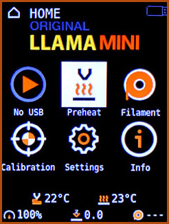
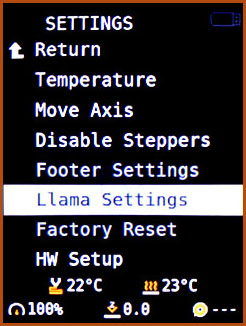
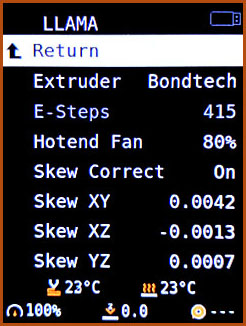
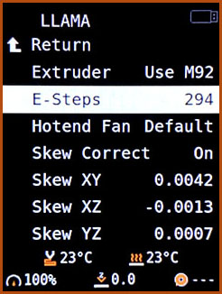
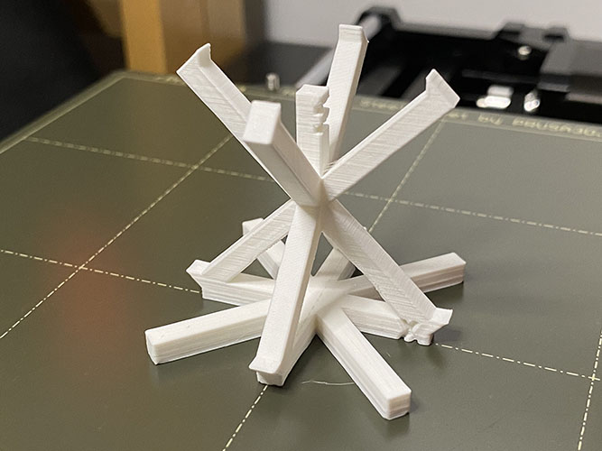

# 

# Llama Mini

[]()

### Unofficial Firmware for the Prusa Mini and Mini+

One of Prusa's llamas escaped from HQ (:llama::running_man:) and decided to make his
own version of the firmware for the Prusa Mini. He's added quite
a few goodies:

* **Configurable E-steps**: Adds a menu option to configure e-steps, with presets for the
  Bondtech extruder (with and without reversed wires).
* **Hotend fan speed**: Adds a menu option to unlock the hotend fan speed
  and increase it from the Prusa Firmware's default 38% to anywhere from 50-100%.
* **Skew compensation**: Turns on skew compensation in Marlin and allows it
  to be configured directly through the Settings menu or with `M852`.
* **OctoPrint screen**: Adds support for `M73` (print progress) and `M117`
  (LCD messages).
* **Sound**: Adds support for `M300` (play a sound).
* **PID tuning**: Automatically writes PID settings to EEPROM after `M303 U1` (autotune),
  `M301` (set hotend PID), and `M304` (set bed PID).

All settings are automatically saved to EEPROM and loaded on boot.








#### Feed the Llama

This plugin is developed in my spare time. If you like it, please
consider supporting further development and updates by making a donation.

[](https://www.paypal.com/donate?business=HPGUMVJFSCXZ4&no_recurring=0&currency_code=USD)

---

## Installing Livestock

### Jailbreak your Mini

You will need to cut out Prusa's appendix to install custom firmware.
Follow the instructions [here](https://help.prusa3d.com/en/article/flashing-custom-firmware-mini_14/).
This is irreversible and voids the warranty, although in the US
you are protected by the [Magnuson-Moss Warranty Act](https://www.ftc.gov/news-events/press-releases/2018/04/ftc-staff-warns-companies-it-illegal-condition-warranty-coverage).

Of course you could always buy a second Buddy board and let your Llama
run wild on that instead.

Alternatively, if you are good at very fine pitch soldering, you could
lift the BOOT0 pin off the board entirely and make your own jumpers
to connect it directly to 3.3V or GND as you need (the appendix merely
[shorts BOOT0 directly to GND](https://hackaday.com/2019/12/16/prusa-dares-you-to-break-their-latest-printer/)).

Once you have done that, you can live and let live-stock.


### Flash Llama

Download the latest release [here](https://github.com/matthewlloyd/Llama-Mini-Firmware/releases).
Copy the `.bbf` file to the root of your USB flash drive.
Follow the instructions [here](https://help.prusa3d.com/en/guide/how-to-update-firmware-mini-mini_128421/)
to install the firmware. The bootloader will warn you the signature is
incorrect - select "Ignore".

### Livestock to Stock

Download Prusa's stock firmware [here](https://www.prusa3d.com/drivers/).
The bootloader might not let you downgrade the firmware unless you
explicitly give permission. Go to the Settings menu, scroll down to "FW Upgrade",
and change the option to "On Restart Older" (this option is only available
in Llama firmware).

To reflash the board in DFU mode, [see below](#flashing-in-dfu-mode).

---

## Configuration

To configure Llama settings, open the Settings menu and select "Llama Settings".
Llogical!

### Configuring E-steps

Select "Extruder" and click to select one of:

- **Prusa**. Stock e-steps for the stock extruder.
- **Bondtech**. Preset e-steps for the [Bondtech extruder upgrade](https://www.bondtech.se/product/prusa-mini/).
  This option assumes you have reversed the motor wiring as per Bondtech's instructions -
  if you haven't, you can reverse the extruder motor direction using the "Reverse E" option.
- **Custom**. The e-steps can be configured using the jog wheel, or by
  sending the `M92 E<steps>` command.

Whether you use a preset, or set custom e-steps via the jog wheel
or `M92`, your settings will automatically be saved to EEPROM.
You do not need to use `M500`.

### Configuring Hotend Fan Speed

The Prusa firmware limits the hotend fan speed to 38% because a happy user is a user with
an underperforming but quiet machine. The fan is capable of running at much
higher RPMs. There are a few reasons you might want to do this:

- Reduce heat creep.
- Print higher temperature filaments.
- Change the fan to one which requires full voltage, e.g. a Noctua.

This menu option allows you to set the hotend fan speed anywhere from 50% to 100%,
in 10% steps. The setting is automatically saved to EEPROM and restored on boot.

### Configuring Skew Compensation

The Prusa Mini+ is inherently prone to skew, by virtue of its cantilever
design. It is normal to see skew on all three axes. This affects the precision
of any parts you print.

Prusa disabled skew compensation in Marlin, because a happy user is a user
with an imprecise but easy to use machine. Lluckily our Llama has reenabled it.
All three skew compensation coefficients are available for use - I for XY, J for XZ,
and K for YZ.

Note it is always preferable to remove as much skew as possible through physical
adjustments before using firmware skew compensation. For excellent
instructions, read [this post on Prusa's forum](https://forum.prusaprinters.org/forum/hardware-firmware-and-software-help/oh-no-were-skewed-prusa-mini-edition/).

See [the section below](#calibrating-skew) for a guide on how to measure skew
and compute the coefficients. You can use the jog wheel to set
the coefficients in this menu, or use `M852`. Either way, the settings
will automatically be saved to EEPROM - you do not need to use `M500`.
Be sure to set `Skew Correct` to `On` for the settings to be used.

Be careful with large skew correction factors - it is possible to go past
the min or max travel on the X and Y axes while printing or even during
mesh bed leveling. A skew factor of e.g. 0.01 equates to
`0.01 * 180mm = 1.8mm` of movement at the far end of the bed,
so your usable print area will be reduced accordingly.

### Configuring PID Parameters

The stock firmware allows you to run an `M303` PID autotune, but the new
settings are lost on reset. In Llama, PID settings are *automatically* written
to EEPROM after any command that updates Marlin's PID values, which could be
an `M301` (set hotend PID), `M304` (set bed PID), or an `M303 U1` (autotune and
use the PID result). These values will then be restored on reset, too. You do not
need to use `M500`.

If you need to restore the default PID values, they can be reset by running
the following commands:

* Hotend: `M301 P7.00 I0.50 D45.00`
* Bed: `M304 P120.00 I1.50 D600.0`

Note that if you run `M303` (autotune) without the `U1` parameter, Marlin
will just print out the suggested PID values without changing the settings,
and they won't get written to EEPROM.

---

### Print Progress

Note that to take advantage of Llama's `M73` support with [OctoPrint](https://octoprint.org),
you will need to install one or more plugins. I recommend these three:

- [Print Time Genius](https://plugins.octoprint.org/plugins/PrintTimeGenius/),
  an excellent plugin to compute accurate progress estimates. It doesn't send
  `M73` or `M117` on its own, so you will need the next two plugins too.
- [DisplayLayerProgress](https://github.com/OllisGit/OctoPrint-DisplayLayerProgress).
  Turn on the "Printer Display" option and customize to your preference.
  This will send `M117`. I like to set the message to `[printtime_left] L=[current_layer]/[total_layers]`
  and the update interval to 10 seconds.
- [M73 Progress](https://plugins.octoprint.org/plugins/m73progress/).
  Be sure to enable the "Use time estimate" option.

It may also be possible to arrange for your slicer to insert these commands,
but the result will not be as accurate.

---

## Calibrating Skew

Measuring skew on all three axes at once can be done by simply printing
[this compact calibration tower](doc/llama/skew.stl):



Turn off skew correction before you print. Use a normal layer height
(0.15mm) and no supports. Do not rotate the model in your slicer -
it must be printed in the same orientation as supplied in the STL.

Then, make a copy of [this spreadsheet](https://bit.ly/2SJ1hAU).
Use [calipers](https://amzn.to/3vVRgOl) to measure the six diagonals,
conveniently labeled A to F, and type the measurements
into the spreadsheet. It will calculate your three skew correction factors.
You can either input them using the Llama menu and jogwheel as described above,
or send them directly to the printer using the supplied `M852` command.

If you want to check your calibration is accurate,
print the same tower with skew correction enabled. The diagonals should
then all have the same length (within measurement error of course).

---

### Flashing in DFU Mode

If the bootloader refuses to accept firmware from a USB flash drive,
it's possible to flash the board directly in DFU mode.

Compile the firmware and build a DFU file. Note this cannot be done on a
Raspberry Pi because Prusa's build system only supports x86 Linux.
Use WSL on Windows, Windows, Linux, or a Mac.

```
$ python3 utils/build.py --generate-dfu --bootloader yes
```

Copy it to your Pi:

```
$ scp build/mini_release_boot/firmware.dfu <user>@<pi-host>:~/
```

Put your Buddy board in DFU mode by placing a jumper across the relevant pins
and resetting. If you have a 3-pin header next to the appendix (older versions
of the board), put the jumper between BOOT0 and 3.3V. If you have a 2-pin header,
just add a jumper.

Then flash from your Pi:

```
$ lsusb
Bus 001 Device 010: ID 0483:df11 STMicroelectronics STM Device in DFU Mode
$ sudo apt install dfu-util
$ dfu-util -a 0 -D firmware.dfu
```

Don't forget to remove the jumper before resetting.

---

*Copyright (C) 2021 Matthew Lloyd*

## Original Prusa Mini Firmware README
<details>
<summary>Click to expand!</summary>

# Buddy
[](https://github.com/prusa3d/Prusa-Firmware-Buddy/releases)
[](https://holly.prusa3d.com/job/Prusa-Firmware-Buddy/job/Multibranch/job/master/)

This repository includes source code and firmware releases for the Original Prusa 3D printers based on the 32-bit ARM microcontrollers.

The currently supported model is:
- Original Prusa MINI

## Getting Started

### Requirements

- Python 3.6 or newer (with pip)

### Cloning this repository

Run `git clone https://github.com/prusa3d/Prusa-Firmware-Buddy.git`.

### Building (on all platforms, without an IDE)

Run `python utils/build.py`. The binaries are then going to be stored under `./build/products`.

- Without any arguments, it will build a release version of the firmware for all supported printers and bootloader settings.
- To generate `.bbf` versions of the firmware, use: `./utils/build.py --generate-bbf`.
- Use `--build-type` to select build configurations to be built (`debug`, `release`).
- Use `--printer` to select for which printers the firmware should be built.
- By default, it will build the firmware in "prerelease mode" set to `beta`. You can change the prerelease using `--prerelease alpha`, or use `--final` to build a final version of the firmware.
- Use `--host-tools` to include host tools in the build (`bin2cc`, `png2font`, ...)
- Find more options using the `--help` flag!

#### Examples:

Build the firmware for MINI in `debug` mode:

```bash
python utils/build.py --printer mini --build-type debug
```

Build _final_ version for all printers and create signed `.bbf` versions:

```bash
python utils/build.py --final --generate-bbf --signing-key <path-to-private-key>
```

Build the firmware for MINI using a custom version of gcc-arm-none-eabi (available in `$PATH`) and use `Make` instead of `Ninja` (not recommended):

```bash
python utils/build.py --printer mini --toolchain cmake/AnyGccArmNoneEabi.cmake --generator 'Unix Makefiles'
```
#### Windows 10 troubleshooting

If you have python installed and in your PATH but still getting cmake error `Python3 not found.` Try running python and python3 from cmd. If one of it opens Microsoft Store instead of either opening python interpreter or complaining `'python3' is not recognized as an internal or external command,
operable program or batch file.` Open `manage app execution aliases` and disable `App Installer` association with `python.exe` and `python3.exe`.

### Development

The build process of this project is driven by CMake and `build.py` is just a high-level wrapper around it. As most modern IDEs support some kind of CMake integration, it should be possible to use almost any editor for development. Below are some documents describing how to setup some popular text editors.

- [Visual Studio Code](doc/editor/vscode.md)
- [Vim](doc/editor/vim.md)
- [Eclipse, STM32CubeIDE](doc/editor/stm32cubeide.md)
- [Other LSP-based IDEs (Atom, Sublime Text, ...)](doc/editor/lsp-based-ides.md)

#### Formatting

All the source code in this repository is automatically formatted:

- C/C++ files using [clang-format](https://clang.llvm.org/docs/ClangFormat.html),
- Python files using [yapf](https://github.com/google/yapf),
- and CMake files using [cmake-format](https://github.com/cheshirekow/cmake_format).

If you want to contribute, make sure to install [pre-commit](https://pre-commit.com) and libtinfo5 and then run `pre-commit install` within the repository. This makes sure that all your future commits will be formatted appropriately. Our build server automatically rejects improperly formatted pull requests.

## Flashing Custom Firmware

To install custom firmware, you have to break the appendix on the board. Learn how to in the following article https://help.prusa3d.com/article/zoiw36imrs-flashing-custom-firmware.

## Feedback

- [Feature Requests from Community](https://github.com/prusa3d/Prusa-Firmware-Buddy/labels/feature%20request)

## License

The firmware source code is licensed under the GNU General Public License v3.0 and the graphics and design are licensed under Attribution-NonCommercial-ShareAlike 4.0 International (CC BY-NC-SA 4.0). Fonts are licensed under different license (see [LICENSE](LICENSE.md)).
</details>
